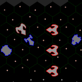
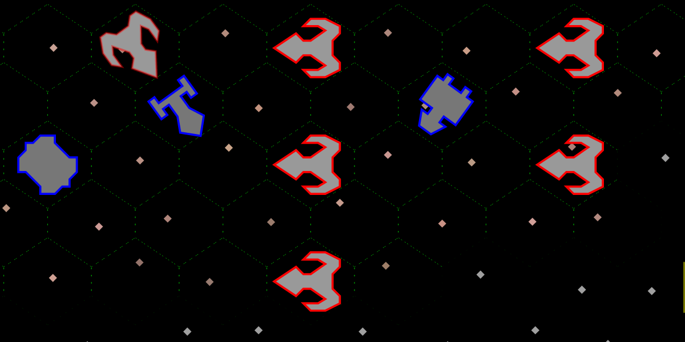

# Captain's Log

This is a wanna be x4 game in 13k using every single trick in the book to save space. I wrote it in two weeks so it is plenty of room for improvements and expansion.
I know it could be far better and there is plenty of space to do it but I ran out of free time.

About funny variable names and minification. I got better results hand crafting the code than using common tools, it is writting in a way where later I can use a simple Python script
to strip off newlines and comments.

```bash
cat cl.html | ./stripper.py > index.html
```

Play it with mouse as a civ game.

https://www.basile.ar/cl/


